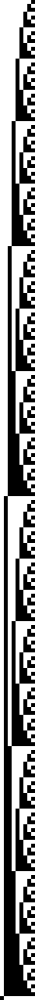
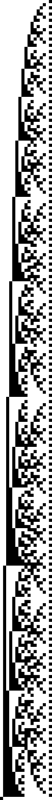
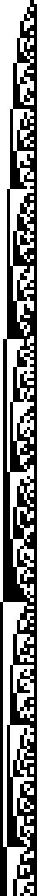
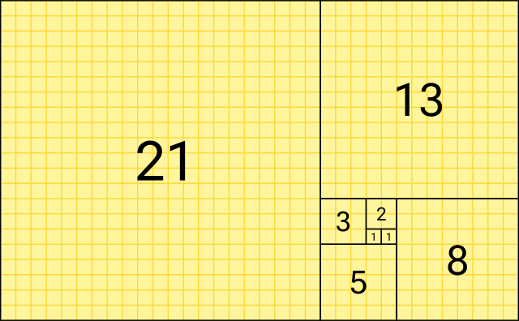
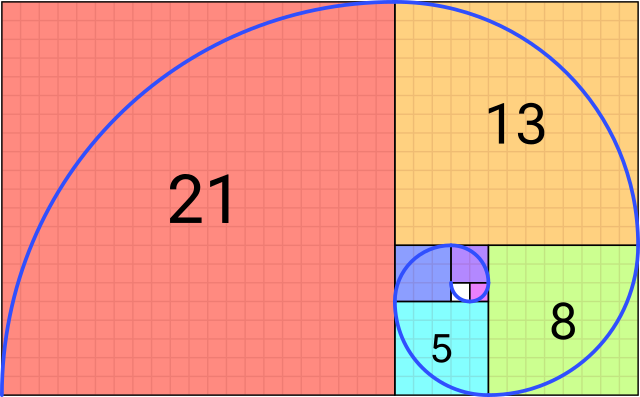

# Systems based on numbers

The main concept discussed in **A New Kind of Science** by Stephen Wolfram is the complexity that results from very simple Cellular Automata. I looked at that in an earlier post [Cellular Automata with F#](https://isthisit.nz/posts/2020/cellular-automata-in-fsharp/). Chapter four of **A New Kind of Science** looks at systems based on numbers:

> The underlying rules for systems like cellular automata are however usually different from those for systems based on numbers. The main point is that the rules for cellular automata are always local: the new color of any particular cell depends only on the previous color of that cell and its immediate neighbors. But in systems based on numbers there is usually no such locality.
> 

Here we explore systems based on numbers and visualise them on a black and white grid.

## Representing Numbers

If numbers are Platonic Forms then that in which we model them are numeral systems. Everyone reading this will be familiar with the base 10 decimal system of numbers, that's what we use in today's culture. But over the centuries humans have developed [different numeral systems](https://en.wikipedia.org/wiki/List_of_numeral_systems). A number is a number, but it can be represented in many different ways.

In this exercise we want to visualise sequences of numbers. We'll restrain ourselves to a very simple visualisation, that of just black and white cells - the same as we did with [Cellular Automata](https://isthisit.nz/posts/2020/cellular-automata-in-fsharp/).

If our goal is black and white cells then we need to represent numbers using the base 2 (binary) numeral system.

```fsharp
let convertToBinary (n: int) =
    Convert.ToString(n, 2).PadLeft(8, '0')

[4; 17; 255] |> List.map convertToBinary
```

```
["00000100"; "00010001"; "11111111"]
```

A quick recap of the binary number system: the digit on the far right hand side is the value **1**, and then each column left is double the previous column.

128 | 64 | 32 | 16 | 8 | 4 | 2 | 1 | Written Out | Value
--- | --- | --- | --- | --- | --- | --- | --- | --- | ---
0 | 0 | 0 | 0 | 0 | 1 | 0 | 0 | 0 + 0 + 0 + 0 + 0 + 4 + 0 + 0 | 4
0 | 0 | 0 | 1 | 0 | 0 | 0 | 1 | 0 + 0 + 0 + 16 + 0 + 0 + 0 + 1 | 17
1 | 1 | 1 | 1 | 1 | 1 | 1 | 1 | 128 + 64 + 32 + 16 + 8 + 4 + 2 + 1 | 255


To visualise a binary number we'll have a row of square cells. Each cell will correspond to a column. Columns with the value **1** will be coloured black, and those with **0** white.

For example **17** is represented as `00010001` in binary and would be visualised as `□□□■□□□■`.

## Big Numbers

The type `int` can store values up to 2,147,483,647. The numbers we're dealing with will get much larger than that so we'll use the type `bigint`. .NET has no built in way to show the binary representation of a `bigint`. Lucky for us Stuart Lang [blogged](https://stu.dev/bigint-to-string-in-any-base-fsharp/) on the topic so we'll use the snippet he provides. Implementation hidden for brevity.

```fsharp
// convertToBinary 99999999999999999
// F# compiler error: This number is outside the allowable range for 32-bit signed integers F# Compiler 1147

bigintAsBinary (bigint 99999999999999999UL)
```

```
"101100011010001010111100001011101100010011111111111111111"
```

## Simple Sequences

We'll start with very simple sequences:

```fsharp
let increment = Seq.initInfinite (fun i -> bigint (i + 1))

increment |> Seq.take 25 |> Seq.toList
```

```
[1; 2; 3; 4; 5; 6; 7; 8; 9; 10; 11; 12; 13; 14; 15; 16; 17; 18; 19; 20; 21; 22;
 23; 24; 25]
```

```fsharp
let squares = Seq.initInfinite (fun i -> bigint (i + 1) ** 2)
squares |> Seq.take 25 |> Seq.toList
```

```
[1; 4; 9; 16; 25; 36; 49; 64; 81; 100; 121; 144; 169; 196; 225; 256; 289; 324;
 361; 400; 441; 484; 529; 576; 625]
```

```fsharp
// source http://www.fssnip.net/3X
let isPrime n =
  let sqrt' = (float >> sqrt >> int) n // square root of integer
  [ 2 .. sqrt' ] // all numbers from 2 to sqrt'
  |> List.forall (fun x -> n % x <> 0) // no divisors

let primes =
  let rec primes' n =
    seq { // sequences are lazy, so we can make them infinite
      if isPrime n then
        yield bigint (n)
      yield! primes' (n+1) // recursing
    }
  primes' 2 // starting from 2

primes |> Seq.take 25 |> Seq.toList
```

```
[2; 3; 5; 7; 11; 13; 17; 19; 23; 29; 31; 37; 41; 43; 47; 53; 59; 61; 67; 71; 73;
 79; 83; 89; 97]
```

```fsharp
generatePng 256 increment 4 "addition256"
generatePng 256 squares 4 "squares256"
generatePng 256 primes 4 "primes256"
```

Addition | Squares | Primes
--- | --- | ---
 |  | 


## Fibonacci

The Fibonacci sequence is documented as early as 200 BCE and is known for [emerging in nature](https://en.wikipedia.org/wiki/Patterns_in_nature#Spirals). It's simple to generate; the next number in the sequence is the sum of the two preceding numbers.

To balance brevity and performance the number generator below is from [Rosetta Code](https://rosettacode.org/wiki/Fibonacci_sequence#F.23).

```fsharp
let fibonacci = Seq.unfold (fun (x, y) -> Some(x, (y, x + y))) (0I,1I)

fibonacci |> Seq.take 16 |> Seq.toList
```

```
[0; 1; 1; 2; 3; 5; 8; 13; 21; 34; 55; 89; 144; 233; 377; 610]
```

Plotting squares with side width equal to numbers in the fibonacci sequence, and then drawing an arc across them gives us the fibonacci spiral.

Fibonacci Squares | Fibonacci Spiral
--- | ---
 | 
[Source](https://en.wikipedia.org/wiki/File:Fibonacci_Squares.svg#hero) | [Source](https://en.wikipedia.org/wiki/File:Fibonacci_Spiral.svg#hero)


Visualising the first 512 fibonacci numbers as binary also gives us an interesting result. In the largely scattered mess there are repeated patterns of upside down right-angled triangles.

```fsharp
generatePng 512 fibonacci 3 "fib512"
```


## Pascal's Triangle

Related to the Fibonacci Sequence is Pascal's Triangle. This is a sequence where numbers in rows are the sum of two parent numbers in the row above them. In some ways this is similar to how we generate [Cellular Automata](https://isthisit.nz/posts/2020/cellular-automata-in-fsharp/). The image below shows that summing shallow diagonals of Pascal's Triangle generates the Fibonacci Sequence.


[Source](https://commons.wikimedia.org/wiki/File:PascalTriangleFibanacci.svg)

```fsharp
// source: https://rosettacode.org/wiki/Pascal%27s_triangle#F.23
let rec nextPascalrow l =
    match l with
    | []      -> []
    | h :: [] -> [bigint 1]
    | h :: t  -> h + t.Head :: nextPascalrow t
 
let pascalsTriangle n = List.scan(fun l i -> bigint 1 :: nextPascalrow l) [bigint 1] [1 .. n]

pascalsTriangle 10
```

```
[[1]; [1; 1]; [1; 2; 1]; [1; 3; 3; 1]; [1; 4; 6; 4; 1]; [1; 5; 10; 10; 5; 1];
 [1; 6; 15; 20; 15; 6; 1]; [1; 7; 21; 35; 35; 21; 7; 1];
 [1; 8; 28; 56; 70; 56; 28; 8; 1]; [1; 9; 36; 84; 126; 126; 84; 36; 9; 1];
 [1; 10; 45; 120; 210; 252; 210; 120; 45; 10; 1]]
```

Here we visualise the 256th row of Pascal's Triangle.

```fsharp
let pascalsTriangleRow = pascalsTriangle 256 |> List.last |> List.toSeq

generatePng 257 pascalsTriangleRow 3 "pascalsRow256"
```


## Conclusion

This has been a short exploration of systems based on numbers. Below is a function for generating the visualisations. This entire blog post is a Literate F# script. You can execute it locally to generate the images. View the source here.

## Generate Image Source Code

At a high level this function takes a sequences of `bigint`s, converts them to binary, and draws them on an image.
A couple of considerations go into this function:

0 The width of the generated image dynamically adjusts to the longest of the `bigint`s passed in.

1 Each cell can be drawn over multiple pixels. Initially I had written this so that one cell is one pixel, however it scaled poorly across screens and the patterns weren't clear.

```fsharp
let generatePng rows (numbers: BigInteger seq) (cellDiameterInPixels: int) filename =
    
    let numbersAsBinary = 
        numbers 
        |> Seq.take rows
        |> Seq.toList
        |> List.map bigintAsBinary

    let longestBinaryString =
        numbersAsBinary
        |> List.sortByDescending (fun s -> s.Length)
        |> List.head
        |> String.length

    let paddedNumbersAsBinary =
        numbersAsBinary
        |> List.map (fun s -> s.PadLeft(longestBinaryString, '0'))

    let image = new Image<Rgba32>(longestBinaryString * cellDiameterInPixels, rows * cellDiameterInPixels);
    let white = new Rgba32(255F, 255F, 100F, 1F);
    let black = new Rgba32(0f, 0f, 0f, 1F);
    
    let withIndexes x = x |> Seq.mapi (fun index item -> (index, item))
    
    for (rowIndex, row) in withIndexes paddedNumbersAsBinary do
                
        for (cellIndex, cell) in withIndexes row do
            
            let colour =
                match cell with
                | '1' -> black
                | '0' -> white
                | _ -> failwith $"Unexpected {cell}"
    

            let startingCellIndex = if cellIndex = 0 then 0 else cellIndex * cellDiameterInPixels
            let startingRowIndex = if rowIndex = 0 then 0 else rowIndex * cellDiameterInPixels

            let drawingLocations = 
                List.allPairs 
                    [startingCellIndex .. (startingCellIndex + cellDiameterInPixels - 1)] 
                    [startingRowIndex .. (startingRowIndex + cellDiameterInPixels - 1)]

            drawingLocations
            |> List.iter (fun v -> image.[fst v, snd v] <- colour)

    image.Save(sprintf "static/gen/%s.png" filename)
```

## Further Reading

* [Cellular Automata with F#](https://isthisit.nz/posts/2020/cellular-automata-in-fsharp/)

* [A New Kind of Science](https://www.wolframscience.com/)


